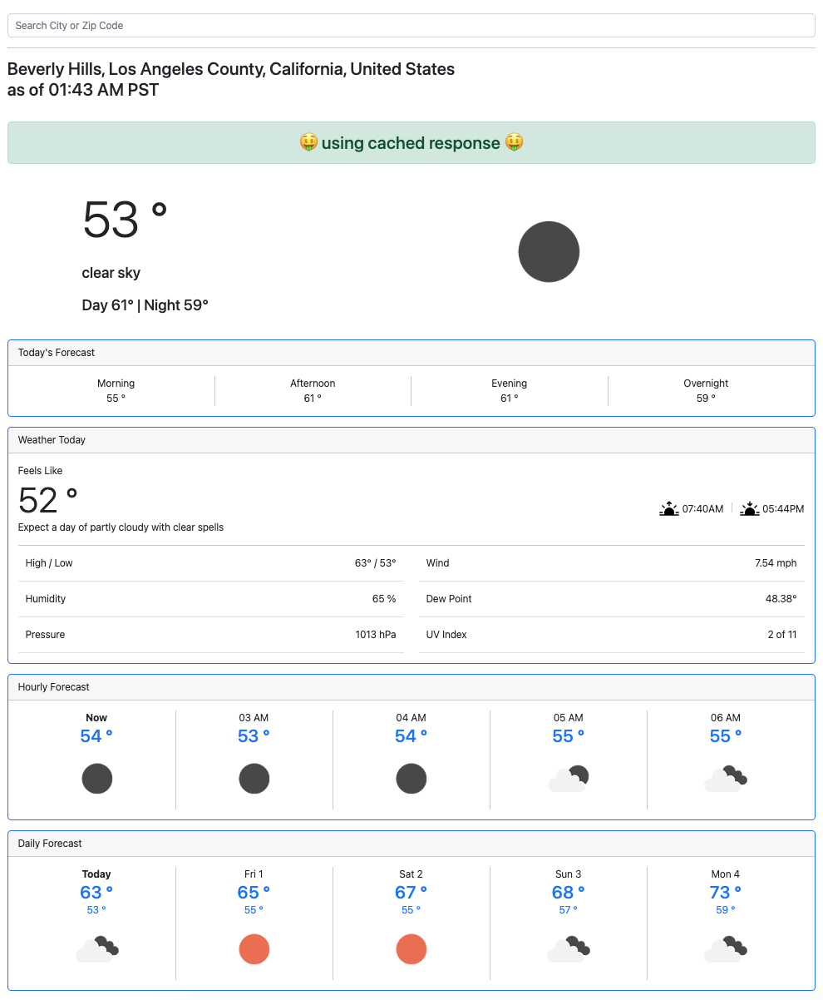

# README

Eric Schmidt
<eric.purdue@gmail.com>

To start this application, run the following commands:
```
$ export OPEN_WEATHER_API_KEY=<key>
$ bin/rails server
$ open http://127.0.0.1:3000
```

Sign up for an OpenWeather API key here: https://home.openweathermap.org/api_keys (or ask me nicely for mine 😉)

# Features

* Accepts a wide variety of location formats from all across the world. Try: `90210`, `Palo Alto`, or `Statue of Liberty`
* If there are ambiguous results, displays up to three `Did you mean?` options (try `Paris` for example)
* Graceful error handling for non-location input
* Current, Hourly, and Daily forecasts with lots of weather data
* Data is cached as requested and I only store the data I used in the cache, not the entire huge response from the OpenWeather API

# Front End

I used bootstrap for a mobile-first approach with well known and easy to use components that can display nicely on any device.

I also made use of the weather icons from the OpenWeather API (and a few from bootstrap).



# Back End

I am getting weather data from the Open Weather API. This requires lat/lon data which I extract from the input utilizing
a series of gems.

Gems:
* rspec-rails - for behavior driven development
* geocoder - get lat/lon data for a given search string
* zip-codes - translate zip codes to city/state (otherwise geocoder acts pretty funky)
* excon - to call the openweather API

# Other
* Ruby version
3.2.2

* Rails version
7.1.2

* Configuration

`export OPEN_WEATHER_API_KEY=<key>`

* How to run the test suite

`rspec spec`

I have a decent amount of tests, but there are more coming.

* Deployment instructions

This is currently only ready for local use. My most recent experience would have me build a docker image to deploy to an ECS container in AWS using CircleCi.

* ...